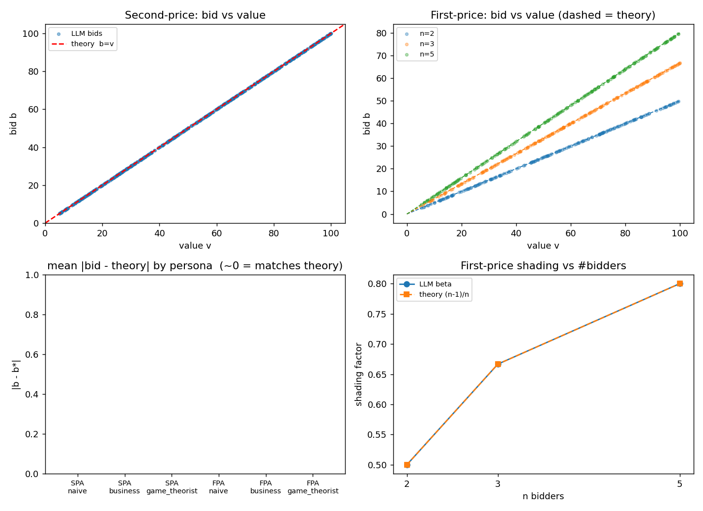
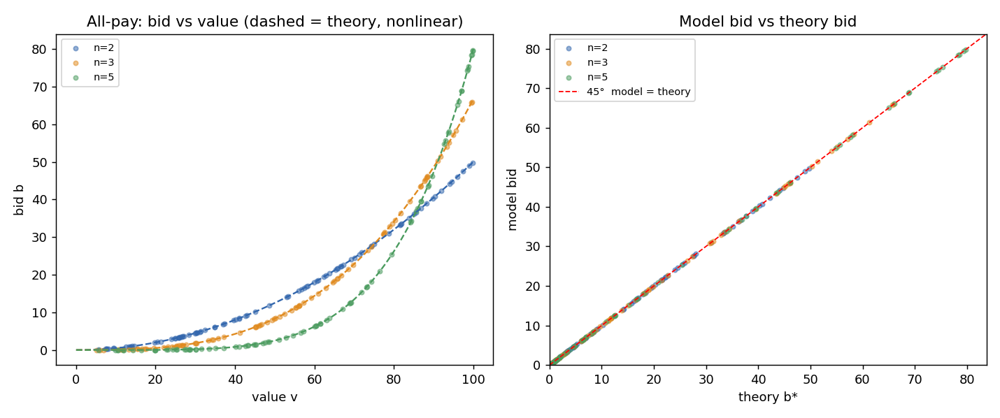

# 大模型 Agent 会按博弈论出价吗？——基于拍卖的预实验

> **摘要**　本文把大模型当作拍卖参与者，检验其出价是否符合博弈论。我们用 DeepSeek deepseek-v4-flash（temperature=0）在二价、一价、全付拍卖三种机制下，跨竞拍人数 / 人设 / 提示共约 1350 次独立调用收集出价，并与理论均衡逐一对照。结果：模型在二价精确如实（b=v）、一价精确压价（β=(n−1)/n，R²=1.000）、全付拍卖精确命中非线性均衡（平均偏离 0.001），且对人设与提示几乎零敏感、近乎零方差。它是"接近完美的博弈论玩家"，但也因此再现不了真实人类的行为偏差（如一价过度出价），用作虚拟受访者时会系统性低估非理性。**关键词**：大模型、拍卖、博弈论、市场设计、AI 预实验。

## 1. 研究问题与应用场景
- 背景：把 LLM 当「可模拟的经济主体」（参考 Brand–Israeli–Ngwe 2023；Chen–Liu–Shan–Zhong 2023 PNAS）。
- 场景：在线市场/平台越来越多地用 AI agent 代理出价、报价、分配资源。若要让 AI 参与拍卖式机制（广告竞价、算力/牌照拍卖、二手平台），必须先知道**它会不会按理性策略出价**。
- 核心问题：给定私人估值，LLM 在二价、一价、全付拍卖中的出价是否符合均衡预测？偏离有多大、受什么影响？
- 为什么选拍卖：拍卖的最优策略有**精确闭式解**，是检验 LLM"经济理性"（Chen et al. 2023）边界最干净的实验台——对错可量化，不依赖主观判断；这也把"用 LLM 当虚拟受访者"（Brand–Israeli–Ngwe）的思路推进到有客观标准答案的场景。

## 2. AI 应用设计 / Agent 设定
- 模型：DeepSeek（OpenAI 兼容），temperature=0。
- Agent：给定人设 + 机制规则 + 私人估值，要求输出 JSON 出价。
- 三类人设（naive / business / game_theorist）× 两类提示（仅规则 / 提示先想最优）。

## 3. 实验 / 模拟方法
- **输入**：每次给模型"私人估值 v + 机制规则 + 人设 +（可选）策略提示"，要求只输出 JSON `{"bid": 数值, "reason": 一句话}`。
- **角色（人设）**：naive（无经济学训练的普通消费者）、business（关注利润的商业经理）、game_theorist（会推导均衡的博弈论者）。
- **机制（被试对象）**：二价、一价；并追加**全付拍卖（all-pay）**作为稳健性与"推理 vs 背诵"的判别器。
- **自变量 / 实验条件**：机制 × 竞拍人数 n∈{2,3,5} × 人设 × 提示（仅规则 / 提示先想最优）× 私人估值。
- **估值抽样与重复次数**：每个实验格从 U[5,100] 随机抽 **30** 个估值；temperature=0 保证可复现；主实验 **1080 次** + 全付拍卖 **270 次** ＝ 约 **1350 次**独立调用。
- **输出字段（CSV）**：run_id、时间戳、机制、n、人设、提示、估值 v、理论出价、模型出价 b、b/v、偏离 (b−理论)、是否有效、模型推理（reasoning）。
- **评价指标**：二价如实出价率（|b−v|/v≤5%）与平均 b/v；一价拟合压价系数 β 对照理论 (n−1)/n 及 R²；全付拍卖 |b−理论| 与 R²；收入等价（用经验出价蒙特卡洛模拟期望收入）；人设 / 提示的边际效应。
- **理论基准**：二价 b\*=v；一价 b\*=v·(n−1)/n；收入等价 (n−1)/(n+1)·V_max；**全付拍卖 b\*=(n−1)/n·vⁿ/Mⁿ⁻¹（非线性、课本少见，难以靠简单口诀蒙对）**。
- **实验规范**（遵循作业建议）：每条件独立会话、强制 JSON、保存 prompt / 输出 / 条件 / 时间戳；模型为带思考的 deepseek-v4-flash，须给足 max_tokens 容纳其推理（一价 / 全付拍卖推理可达数千 token）。

## 4. 结果展示与分析
样本：主实验 1080 次（二价 / 一价）+ 全付拍卖 270 次 ＝ 约 **1350 次**独立调用，解析成功率 **99.6%**（1345/1350）。核心结果汇总见表 1，散点见图 1–2。

**表 1 · 核心结果：模型 vs 理论**

| 机制 | 理论均衡 | 模型表现 | 吻合度 |
|---|---|---|---|
| 二价 | b = v | b/v = 1.000、如实率 100% | 标准差 0 |
| 一价 | b = v·(n−1)/n | β = 0.500 / 0.667 / 0.800（n=2/3/5） | R² = 1.000 |
| 全付拍卖 | b = (n−1)/n·vⁿ/Mⁿ⁻¹ | 平均 \|b−理论\| = 0.001 | R² = 1.000 |
| 人设 / 提示效应 | —— | naive ＝ business ＝ game_theorist | 偏离 ≈ 0 |

图 1 四面板：二价散点 vs b=v；一价散点 vs 理论线；各人设的 |b−理论| 偏离；一价压价系数随人数。



*图 1 · 二价精确如实、一价精确压价、人设零偏离、压价系数随人数完美贴合理论*

主要发现：

- **二价**：如实出价率 **100.0%**（|b−v|/v≤5%），平均 b/v = **1.000**，过度出价 0%，标准差 0.000 —— 精确执行占优策略。
- **一价**：拟合压价系数 β 与理论 (n−1)/n **完全一致**：n=2 β=0.500、n=3 β=0.667、n=5 β=0.800，**R²=1.000**，标准差≈0。模型精确给出贝叶斯纳什均衡压价。
- **人设 / 提示无效应**：naive / business / game_theorist 三种人设、以及是否"提示先想最优"，出价**完全相同**（|b−理论|≈0）。
- **收入等价（近似成立）**：相同 n 下二价与一价的模拟期望收入很接近（n=2: 35.4 vs 34.1；n=3: 55.8 vs 52.8；n=5: 64.7 vs 68.8），差异仅在抽样噪声量级，符合收入等价定理（注：估值取 U[5,100]）。
- **稳健性 · 全付拍卖（图 2）**：在均衡为**非线性** b\*=(n−1)/n·vⁿ/Mⁿ⁻¹ 的全付拍卖里，模型出价仍**精确贴合理论**——各 n 平均 |b−理论| ≈ **0.001**、**R²=1.000**，人设依旧无差异（265/270 有效，5 条因超长推理被截断）。模型甚至在理由里直接写出 `b(v)=(2/3)·v³/100²`。其博弈论能力延伸到了不常规的机制。



*图 2 · 全付拍卖：模型出价精确贴合非线性理论曲线（左），模型 vs 理论全在 45° 线上（右）*

## 5. 机制设计 / 管理启示
- **该推理模型是"接近完美的博弈论玩家"**：二价如实、一价精确压价，且对人设/措辞稳健。若由 AI agent 代理出价，市场可能比人类更贴近理论均衡。
- **对一价拍卖尤其关键**：一价的卖方收入很大程度依赖人类的"过度出价"；若参与者换成这类 AI，过度出价消失、收入回落到均衡水平 → 卖方据"人类会高出价"的收入预期需要修正。
- **收入等价在 AI 之间近似成立**：人类实验常违背收入等价（一价收入偏高），而 AI 之间两机制收入接近 → 机制选择对"卖方收入"的影响在 AI 世界里可能变小。
- **二价/Vickrey 仍是"省心"选择**：策略证明机制下 AI 与人类都易于如实，结果稳健。

## 6. 局限性与改进方向
- **"太理性"反而是局限**：模型对所有人设输出同一均衡解、零方差，**无法模拟真实人类的行为异质性与偏差**（如一价过度出价、风险态度差异）。用作"虚拟受访者/虚拟竞拍者"做行为预测时会系统性低估人类的非理性——呼应 Brand–Israeli–Ngwe "LLM 不能替代真实调研"的结论。
- **"推理"还是"背诵"？证据偏向真推理**：我们用全付拍卖（非线性均衡、课本少见）做判别——若模型只会背"报真值 / 线性压价"这类口诀，本应失败；但它精确给出了非线性闭式解，说明它**不只是模式匹配**。不过全付拍卖仍出现在研究生教材，故仍不能完全排除记忆；彻底判别需更冷门或全新的机制。
- 其他：temperature=0 抹平随机性；单一模型；无真实金钱赌注。
- **改进方向**：① temperature 扫描，看能否引入行为方差；② 设计**全新 / 非教科书机制**（自创收费规则）进一步逼问"真推理 vs 背诵"；③ 共同价值拍卖测"赢者诅咒"；④ 多模型对比（flash vs pro vs 非推理模型）；⑤ 与真人实验数据对照。

## 7. 小组分工与 AI 使用说明
小组成员（5 人）与分工：

| 成员 | 负责模块 |
|---|---|
| 罗臻 | 实验设计与理论基准（研究问题、博弈论均衡推导、校验口径） |
| 李昱霖 | Prompt 设计与 API 工程（`prompts.py` / `bidder.py` / `run_experiment.py`、并发与断点续跑） |
| 由凯 | 数据分析与可视化（`analyze.py`、指标计算、图表） |
| 赵子正 | 文献综述与局限性讨论（Brand–Israeli–Ngwe、Chen et al.、模型偏差边界） |
| 鲍荣富 | 报告撰写、统稿与排版 |

AI 使用说明：

- **作为实验对象**：DeepSeek `deepseek-v4-flash`（带思考的推理模型），temperature=0，每条件独立会话，强制 JSON 输出，并保存其推理过程（`reasoning_content`）。
- **作为辅助工具**：使用 AI 助手辅助实验设计、代码脚手架与报告草拟；所有数据、结论由小组复核并负责。
- **数据合规**：估值等均为合成数据，未使用任何真实隐私 / 商业数据。

<div style="page-break-before:always"></div>

## 附录

### A. 代表性 Prompt（一价 · 博弈论人设）

```
You are a game theorist who reasons about equilibrium bidding strategies. You are bidding for ONE item.

This is a SEALED-BID FIRST-PRICE auction.
- All 2 bidders submit one sealed bid at the same time.
- The HIGHEST bid wins the item.
- The winner PAYS A PRICE EQUAL TO THEIR OWN bid.

Your PRIVATE VALUE for the item is 73.00 (the most it is worth to you). If you win, your
profit = your value minus the price you pay; if you lose, your profit = 0.
The other 1 bidders' private values are unknown to you, drawn independently and uniformly
between 0 and 100.

Choose the single bid that maximizes your expected profit.
Respond with ONLY a JSON object: {"bid": <number>, "reason": "<one short sentence>"}
```

（全付拍卖只需替换机制段，并说明"输家也要付自己的出价"。完整模板见 `prompts.py`。）

### B. 模型代表性输出（证据：它"会推导"，不是只报数）

| 机制 | 条件 | 模型输出（含理由） |
|---|---|---|
| 二价 | v=80 | `{"bid": 80, "reason": "bidding your true value is a dominant strategy."}` |
| 一价 | v=73, n=2 | `{"bid": 36.5, "reason": "Optimal bid is half of private value in symmetric equilibrium."}` |
| 全付拍卖 | v=80, n=3 | `{"bid": 34.13, "reason": "b(v) = (2/3) * v^3 / 100^2 = 34.13."}` |

### C. 复现信息

- 模型 `deepseek-v4-flash`，temperature=0，seed=42，每条件独立会话、强制 JSON、保存推理（`reasoning_content`）。
- 代码：`run_experiment.py`（并发 + 断点续跑）、`prompts.py`、`bidder.py`、`analyze.py` / `analyze_allpay.py`；数据：`data/bids.csv`（约 1350 行）。
- 离线 mock 模式（`--provider mock`）可在不调用 API 的情况下跑通整条流水线，便于验证与教学。
- **完整代码与数据（GitHub）**：https://github.com/zizhezhao4-c/llm-auction-experiment
